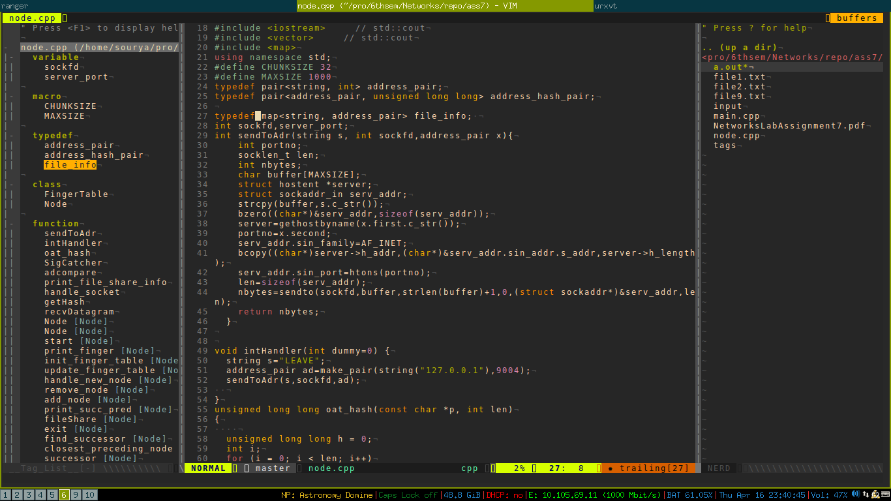

I have started my configuration using [vivekrai's configuration](https://github.com/vivekiitkgp/Dotfiles-vim)
as the base. If you want a more structured configruation I would suggest to have
a look at his config. My configuration is bound to have errors. I will make it
more robust when I find the time.

I am using git submodules for managing most of the plugins. However, some
plugins don't have git repos(hosted on vimscripts or sourceforge). I will name
those plugins here so that you can install them manually into the `bundle`
folder.

1.[taglist](http://vim.sourceforge.net/scripts/script.php?script_id=273) for
getting set of tags

Installation
------------
If you want to fetch `master` branch :

    git clone -b master --single-branch https://github.com/ma08/Dotfiles-vim.git ~/.vim
or if you want to fetch 'minimal' branch:

    git clone -b minimal --single-branch https://github.com/ma08/Dotfiles-vim.git ~/.vim
The common instructions then follow - 

    cd .vim
    git submodule init
    git submodule update
    git submodule foreach git submodule init
    git submodule foreach git submodule update

*Symlinks*

    ln -s ~/.vim/.vimrc ~/.vimrc
    ln -s ~/.vim/.gvimrc ~/.gvimrc

Although I do not plan to add anything new at the moment, you can see frequent
changes in the .(g)vimrc file.

Important
---------
### (For `master` branch)
This Vim configuration uses two plugins and a program  all of which require a little more configuration on behalf of user.
* `YouCompleteMe` plugin ( a code completion engine for
vim ) requires a compiled component. After completing steps mentioned above, please refer to [this page]
(https://github.com/Valloric/YouCompleteMe#full-installation-guide) and follow
the instructions accordingly.
* `CtrlP` plugin uses the Silver Searcher for fast rendering of results. You may wish to install it separately if you want to use that feature. Please note that in case latter is unavailable, `CtrlP` continues to work.
* If you see strange characters in status line or improper appearance then please see the [FAQs] (https://github.com/bling/vim-airline/wiki/FAQ) for the `vim-airline` plugin.

If however you do not want to use these plugins, then remove these submodules from your `git` repository and comment/remove the following section from your `.(g)vimrc` -

    let g:ycm_autoclose_preview_window_after_completion=1
    let g:ycm_confirm_extra_conf = 0
    let g:ycm_goto_buffer_command='vertical-split'
    let g:ycm_collect_identifiers_from_tags_files = 1
    let g:ycm_global_ycm_extra_conf = '~/.ycm_extra_conf.py'
    let g:airline_powerline_fonts=1
    let g:airline#extensions#tmuxline#enabled = 1
    let g:airline#extensions#tabline#enabled = 1

Colors
----------
Make sure that you have a terminal with 256 color support to get good colors in
the terminal. Check the output of `tput colors`. Also run the
256colors2.pl(search for it) to check if the desired colors are produced.

For urxvt make sure you install rxvt-unicode256color package to get 256 colors.

Set `t_Co=256` in vimrc accordingly for your term.

Screenshot
----------
The following is a screenshot of vim in urxvt with a cpp file. 

The following is a screenshot of vim in urxvt with a cpp file open with tag list
open.

The following is a screenshot of gvim with a cpp file with tag list open. 

Feedback
--------
Feel free to drop fork, modify or suggest any changes you like.
